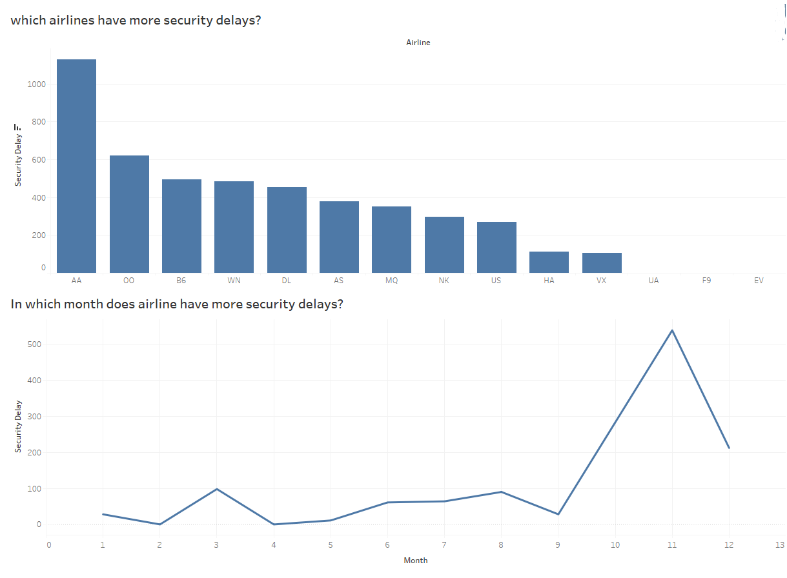
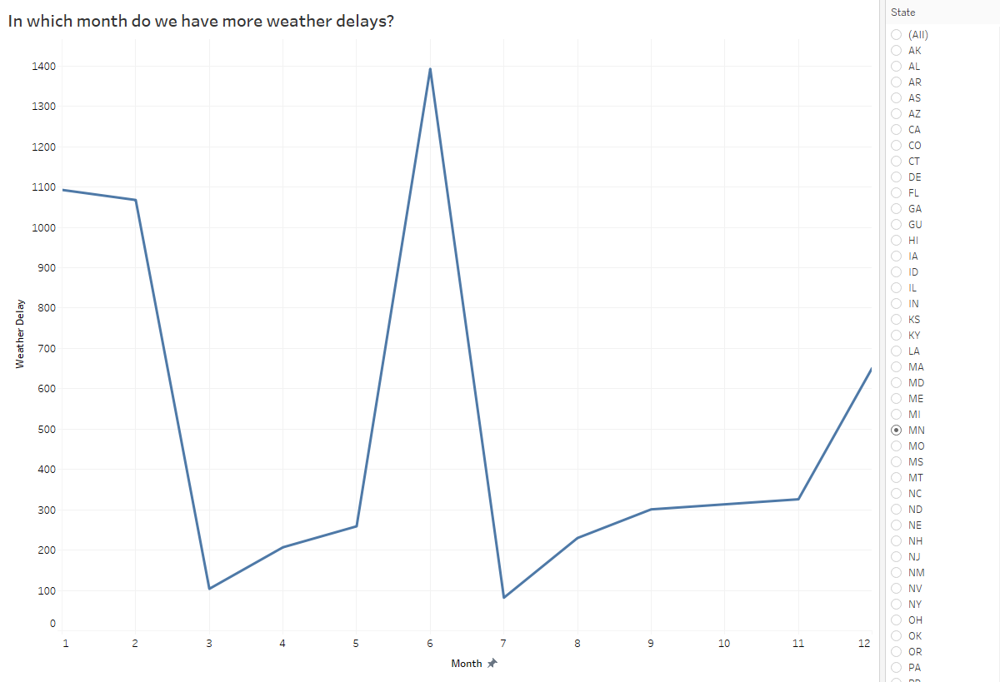

# Business Analytics Projects

This project leverages two datasets, namely the Chinook Music Store database and the Flight Weather Delays dataset, to gain insights and make informed business decisions.

## Chinook Music Store
The Chinook Music Store Database is a fictional database that I have worked with as part of my business analytics projects. This database provides a comprehensive collection of data related to a music retail business, including information about customers, employees, sales, and inventory.

### Insights

- ### Genres with fewest tracks 

- ### High performing playlist by sales 

- ### Identifying Country with Largest share of our customers store 

- ### Sales Support Agents Performance  

## Flight Delays and Cancellations
The Flight Delays and Cancellations dataset is a valuable resource that I have utilized as part of my business analytics projects. This dataset contains historical data on flight departures and arrivals, along with information regarding weather conditions at various airports.

### Insights

1- 

2- 

3- 

### Resources
- Dashboard: https://public.tableau.com/app/profile/abdulrahman.albaqami/viz/Dashboard-airlinesDelays/Dashboard2?publish=yes
